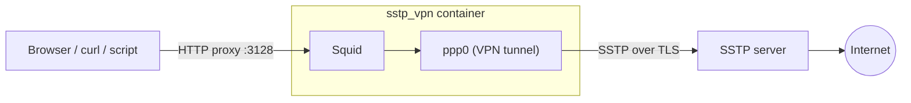

# sstp_proxy_docker

A Docker container that connects to an **SSTP VPN** server and exposes an
**HTTP/HTTPS proxy** (Squid) on port `3128`. Everything you send through the
proxy leaves via the VPN, while the rest of your machine keeps using its
normal connection.

Useful when you want only one browser, script or tool to go through a VPN,
for example through the SSTP server on your home router (Keenetic, MikroTik)
or a Windows RRAS server, without switching the whole system to the VPN.



## How it works

On start, [`src/sstp_starter.sh`](src/sstp_starter.sh):

1. Connects to the SSTP server with `sstpc` (which runs `pppd`) and waits
   until the `ppp0` interface gets an IP address.
2. Makes `ppp0` the container's default route, so all outgoing traffic goes
   through the tunnel. Policy routing keeps the SSTP session itself and
   replies to proxy clients on the regular Docker interface (`eth0`).
3. Uses the DNS servers pushed by the VPN server (or `VPN_DNS`), so DNS
   queries also go through the tunnel.
4. Only then starts Squid on port `3128`.

If the tunnel or Squid dies, the container exits and Docker restarts it
(`restart: unless-stopped`). While the tunnel is down there is no default
route and no running proxy, so traffic never leaks past the VPN. IPv6 is
disabled in the container for the same reason.

## Requirements

- Docker with Docker Compose v2.
- A kernel with PPP support: the `/dev/ppp` device and the `ppp_async`
  module.
  - **Windows (Docker Desktop, WSL2):** works out of the box. Tested on
    Windows 11 with the WSL2 kernel 6.6.
  - **Linux:** load the modules on the host if they are not loaded yet:
    ```bash
    sudo modprobe ppp_generic ppp_async
    ```
- An SSTP VPN account: server address, username and password.

The container needs `NET_ADMIN` (to manage routes), `SYS_MODULE` (so the
kernel can load `ppp_async` for `pppd`) and access to `/dev/ppp`. All of
this is already set in [`docker-compose.yaml`](docker-compose.yaml).

## Quick start

```bash
git clone https://github.com/V0ch0n0k/sstp_proxy_docker.git
cd sstp_proxy_docker
cp .env.template .env
```

Put your server and credentials into `.env`:

```dotenv
SSTP_SERVER="vpn.example.com"
USERNAME="your-username"
PASSWORD="your-password"
```

If the password contains `$`, use single quotes (`PASSWORD='pa$$word'`),
otherwise Docker Compose treats `$` as a variable.

Build and start:

```bash
docker compose up -d --build
docker compose logs -f
```

The container is ready when the log shows:

```
[starter] tunnel up: ppp0 ip=192.168.96.2
[starter] default route -> ppp0
[starter] dns: 192.168.4.1
[starter] squid started
```

The proxy is now available at `http://localhost:3128`.

## Configuration

All settings live in `.env` (see [`.env.template`](.env.template)).

| Variable | Required | Default | Description |
|---|---|---|---|
| `SSTP_SERVER` | yes | | SSTP server hostname or IP address |
| `USERNAME` | yes | | VPN username |
| `PASSWORD` | yes | | VPN password |
| `SSTP_IGNORE_CERT` | no | `false` | `true` skips verification of the server's TLS certificate. Needed for self-signed certificates (common on routers). Only enable it if you trust the network path to the server |
| `VPN_DNS` | no | `1.1.1.1` | DNS server used when the VPN server does not push its own. Queries still go through the tunnel |
| `SSTP_PPPD_OPTS` | no | | Extra `pppd` options, space-separated, e.g. `refuse-eap noccp` |
| `SSTP_CONNECT_TIMEOUT` | no | `60` | Seconds to wait for `ppp0` before giving up and restarting |
| `SSTP_LOG_LEVEL` | no | `1` | `sstpc` log verbosity, `0` (errors) to `4` (debug) |

After changing `.env`, recreate the container:

```bash
docker compose up -d --force-recreate
```

## Using the proxy

Point any HTTP proxy-aware client at `http://localhost:3128`. HTTPS and
WebSocket (`ws://`, `wss://`) work too: the client opens a `CONNECT` tunnel
through Squid.

**curl**

```bash
curl -x http://localhost:3128 https://ifconfig.me
```

**Environment variables** (most CLI tools and libraries respect them)

```bash
export HTTP_PROXY=http://localhost:3128
export HTTPS_PROXY=http://localhost:3128
```

**Python (`requests`)**

```python
import requests

proxies = {"http": "http://localhost:3128", "https": "http://localhost:3128"}
print(requests.get("https://ifconfig.me", proxies=proxies).text)
```

**Browser.** Firefox has its own proxy settings that do not affect the rest
of the system: *Settings → Network Settings → Manual proxy configuration*,
HTTP Proxy `localhost`, port `3128`, and check *Also use this proxy for
HTTPS*.

### Who can connect

Squid accepts requests from `localhost` and from private networks
(`10.0.0.0/8`, `172.16.0.0/12`, `192.168.0.0/16`) and denies everything
else, so it is not an open proxy. The port is published on all host
interfaces, which lets other devices on your LAN use it as well. To allow
only this machine, publish the port on localhost in `docker-compose.yaml`:

```yaml
    ports:
      - "127.0.0.1:3128:3128"
```

The proxy has no authentication, so never expose port `3128` to the
internet.

## Checking that it works

[`check_proxy.py`](check_proxy.py) shows whether traffic really goes
through the VPN. It uses only the Python standard library (Python 3.8+):

```bash
python check_proxy.py
```

The script:

1. checks that the proxy port is open;
2. requests `ipinfo.io` directly and through the proxy (HTTP and HTTPS) and
   compares the external IP, which should be different;
3. opens a WebSocket through the proxy and waits for an echo server to
   return a random message.

It exits with code `0` on success and `1` if the proxy is unreachable,
a request or the WebSocket fails, or the external IP is the same as without
the proxy.

## Logs

| Where | What |
|---|---|
| `docker compose logs` | Startup steps, `sstpc` and Squid output |
| `logs/vpn/sstp.log` | `sstpc` output |
| `logs/squid/access.log` | Every proxied request (`TCP_TUNNEL ... CONNECT host:443` for HTTPS and WebSocket) |
| `logs/squid/cache.log` | Squid's own log |

Log files are ignored by git.

## Troubleshooting

**The container keeps restarting.** Look for `[starter] ERROR` in
`docker compose logs`; it tells which step failed.

**`sstpc exited` right after `connecting to ...`.** To see `pppd`'s own
messages, which are hidden by default, add to `.env`:

```dotenv
SSTP_LOG_LEVEL=4
SSTP_PPPD_OPTS="debug logfd 2"
```

Then check the most common causes:

- `Couldn't set tty to PPP discipline: Operation not permitted`: the
  kernel cannot load `ppp_async`. Make sure `SYS_MODULE` is in `cap_add`;
  on Linux, run `sudo modprobe ppp_async` on the host.
- Certificate or SSL handshake errors: the server uses a self-signed
  certificate. Set `SSTP_IGNORE_CERT=true`.
- Authentication failures: check the credentials and quoting in `.env`.
  With Windows RRAS servers, `SSTP_PPPD_OPTS="refuse-eap noccp"` often
  helps.

**`/dev/ppp not found`** or Compose fails with `error gathering device
information`: the host kernel has no PPP support loaded. On Linux run
`sudo modprobe ppp_generic`.

**`ppp0 did not come up in 60s`**: the server is slow or unreachable.
Increase `SSTP_CONNECT_TIMEOUT` and check that the server address is
reachable from your network.

**The proxy works but the IP is the same as without it**: run
`python check_proxy.py` and `docker compose exec sstp_vpn ip route`. The
default route must be `dev ppp0`.

## Project structure

```
.
├── Dockerfile            # Ubuntu 24.04 + sstp-client, ppp, squid
├── docker-compose.yaml   # capabilities, /dev/ppp, port 3128, log volumes
├── .env.template         # configuration template, copy to .env
├── check_proxy.py        # end-to-end check: IP, HTTP/HTTPS, WebSocket
├── src/
│   ├── sstp_starter.sh   # connects the VPN, sets up routing and DNS, runs Squid
│   └── squid.conf        # proxy port and access rules
└── logs/                 # vpn/ and squid/ logs (mounted into the container)
```

## Security notes

- `.env` contains your VPN credentials. It is listed in `.gitignore`;
  do not commit it.
- `SYS_MODULE` lets the container load kernel modules. It is needed only
  for `ppp_async`; if the module is already loaded on the host (e.g.
  `sudo modprobe ppp_async` on Linux), you can remove `SYS_MODULE` from
  `docker-compose.yaml`.
- `SSTP_IGNORE_CERT=true` disables server certificate verification and
  makes the connection vulnerable to man-in-the-middle attacks.
